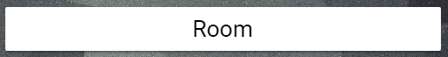

# Image link

This Card allows you to create banner linking a url to a image.


## Options

| Name | Type | Requirement | Description
| ---- | ---- | ------- | -----------
| type | string | **Required** | `custom:img-link`
| url | string | **Required** | A url you want to link, ex. "https://www.home-assistant.io/"
| image | string | **Required** | The image you want to show, ex. "/local/.../home.png"

## Instalacion

### Step 1

Install `img-link` by copying `img-link.js`from this repo to `<config directory>/www/img-link.js` on your Home Assistant instanse.

**Example:**

```bash
wget https://raw.githubusercontent.com/assur93/Lovelace/master/image-link/img-link.js
```

### Step 2

Link `img-link` inside you `ui-lovelace.yaml`.

```yaml
resources:
  - url: /local/img-link.js?v=0
    type: js
```

### Step 3

Add a custom element in your `ui-lovelace.yaml`

```yaml
      - type: custom:img-link
        image: /local/icons/banner.png
        url: https://www.home-assistant.io/
```


