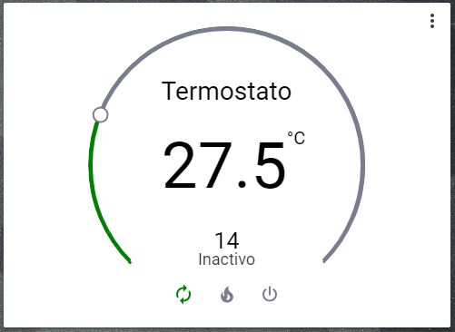

# Climate Thermostat

This Card allows you to create a simple Beok thermostat.


## Installation

### Step 1

Install `broadlinkHysen` by copying `broadlinkHysen.py`from this repo to `<config directory>/custom_components/climate/broadlinkHysen.py` on your Home Assistant instanse.

**Example:**

```bash
wget https://raw.githubusercontent.com/assur93/Lovelace/master/climate/broadlinkHysen.py
```

### Step 2

Link `broadlinkHysen` inside you `configuration.yaml`.

```yaml
climate:
  - platform: broadlinkHysen
    friendly_name: your_name
    host: xxx.xxx.xx.xxx
    mac: xx:xx:xx:xx:xx:xx
```

### Step 3

Add a thermostat element in your `ui-lovelace.yaml`

```yaml
      - type: thermostat
        entity: climate.your_name
        name: Title
```

### Options

Before installing the thermostat in Home Assistant, configure the thermostat following the config-Beok.pdf


