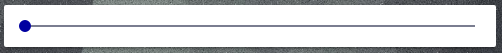

# Cover Slider

This Card allows you to create a slider, just a slider full size without name. It is possible to change the min, max and step.


## Options

| Name | Type | Requirement | Description
| ---- | ---- | ------- | -----------
| type | string | **Required** | `custom:cover-slider`
| entity | string | **Required** | The cover name, ex. "cover.roller1"
| min | string | **Optional** | The min value. Default: 0
| max | string | **Optional** | The max value. Default: 100
| step | string | **Optional** | The step value. Default: 5

## Installation

### Step 1

Install `cover-slider` by copying `cover-slider.js`from this repo to `<config directory>/www/cover-slider.js` on your Home Assistant instanse.

**Example:**

```bash
wget https://raw.githubusercontent.com/assur93/Lovelace/master/cover-slider/cover-slider.js
```

### Step 2

Link `cover-slider` inside you `ui-lovelace.yaml`.

```yaml
resources:
  - url: /local/cover-slider.js
    type: module
```

### Step 3

Add a custom element in your `ui-lovelace.yaml`

```yaml
      - type: custom:cover-slider
        entity: cover.roller1
```


