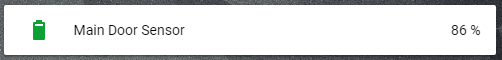

# Battery line

This Card allows you to create a battery entity in a line. This entity automatically changes the icon and the icon color, depending on the battery level.

## Options

| Name | Type | Requirement | Description
| ---- | ---- | ------- | -----------
| type | string | **Required** | `custom:battery-entity`
| entity | string | **Required** | An entity_id that has a percentage as a state.
| name | string | **Optional** | Override the entities friendly name.
| warning | integer | **Optional** | Sets the level at which the battery icon will be shown as yellow. Default: 15
| critical | integer | **Optional**| Sets the level at which the battery icon will be shown as red. Default: 35
| unit | string | **Optional**| Sets the unit of the entity Default: entity.attribute


## Installation

### Step 1

Install `custom-battery` by copying `custom-battery.js`from this repo to `<config directory>/www/custom-battery.js` on your Home Assistant instanse.

**Example:**

```bash
wget https://raw.githubusercontent.com/assur93/Lovelace/master/custom-battery/custom-battery.js
```

### Step 2

Link `custom-battery` inside you `ui-lovelace.yaml`.

```yaml
resources:
  - url: /local/custom-battery.js
    type: module
```

### Step 3

Add a custom element in your `ui-lovelace.yaml`

```yaml
      - type: custom:custom-battery
        entity: sensor.main_door_battery
        name: Main Door Sensor
        unit: '%'
```


