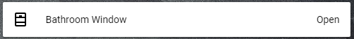

# Entity Line

This Card allows you to create a custom entity in a line. It is possible to edit the icon, the color of the icon, the name and the state.


## Options

| Name | Type | Requirement | Description
| ---- | ---- | ------- | -----------
| type | string | **Required** | `custom:custom-line`
| name | string | **Required** | The entity name, ex. "Main Door"
| icon | string | **Optional** | The entity icon. Default: "mdi:door-open"
| color | string | **Optional** | The icon color. Default: rgb(0,0,160)
| state | string | **Optional** | The entity state. Default: "Abierta"

## Installation

### Step 1

Install `custom-line` by copying `custom-line.js`from this repo to `<config directory>/www/custom-line.js` on your Home Assistant instanse.

**Example:**

```bash
wget https://raw.githubusercontent.com/assur93/Lovelace/master/custom-line/custom-line.js
```

### Step 2

Link `custom-line` inside you `ui-lovelace.yaml`.

```yaml
resources:
  - url: /local/custom-line.js
    type: module
```

### Step 3

Add a custom element in your `ui-lovelace.yaml`

```yaml
      - type: custom:custom-line
        name: Bathroom Window
        icon: mdi:window-open
        color: rgb(0,0,0)
        state: Open
```


