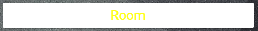

# Label Card

This Card allows you to create a card with only text like a label. It is possible to change the size, the position of the text and the colour.


## Options

| Name | Type | Requirement | Description
| ---- | ---- | ------- | -----------
| type | string | **Required** | `custom:label-card`
| title | string | **Required** | The text you want to show, ex. " Room "
| scale | string | **Optional** | The size of the text. Default: 50px
| colour | string | **Optional** | The color of the text. Default "rgb(0,0,0)" 

## Installation

### Step 1

Install `label-card` by copying `label-card.js`from this repo to `<config directory>/www/label-card.js` on your Home Assistant instanse.

**Example:**

```bash
wget https://raw.githubusercontent.com/assur93/Lovelace/master/label-card/label-card.js
```

### Step 2

Link `label-card` inside you `ui-lovelace.yaml`.

```yaml
resources:
  - url: /local/label-card.js
    type: module
```

### Step 3

Add a custom element in your `ui-lovelace.yaml`

```yaml
      - type: custom:label-card
        title: Room
        scale: 20px
        colour: rgb(255,255,25)
```


